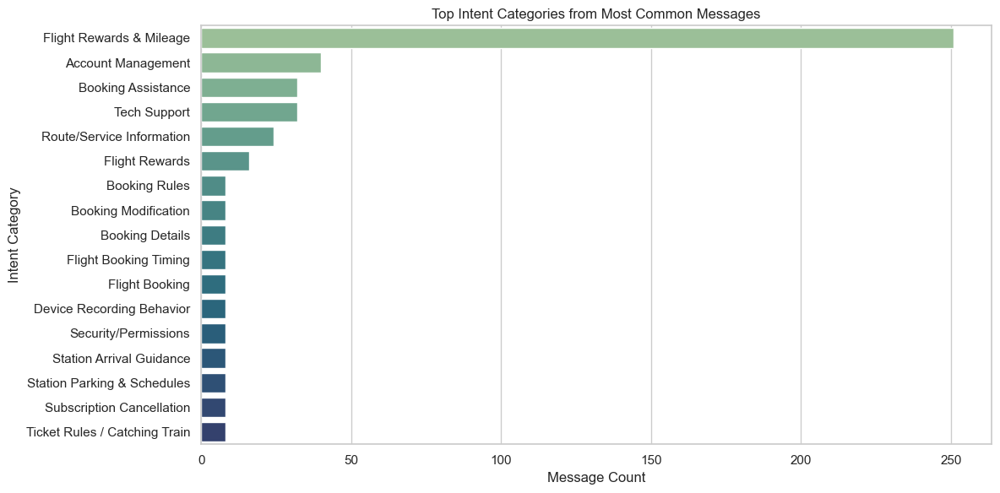

# Customer Interaction Analysis for Conversational AI

This project analyzes real-world customer service chat data to uncover patterns in user queries, language structure, and recurring intents. The goal is to extract insights that can improve the training, tagging, and behavior of AI-powered conversational systems.

## Project Scenario

This case study simulates the role of a data analyst embedded in a conversational AI team. Using anonymized support chat data, the objective is to identify message patterns, map user intent, and recommend strategies for improving AI-driven intent recognition.

## Key Objectives

- Explore chat message structure and phrasing
- Identify frequently asked questions and recurring topics
- Group high-volume queries into manually labeled intent categories
- Highlight language patterns useful for training AI systems
- Recommend improvements to data tagging and response design




## Key Insights

- Most messages are short, informal, and context-light — challenging for AI to interpret
- Top repeated queries relate to flight rewards, account changes, booking issues, and tech support
- Phrasing starters like “how do I” and “I need to” appear frequently and can guide intent detection
- Manual intent grouping of top queries simulates early-stage tagging for AI training datasets

## Folder Structure

```
customer_interaction_analysis/
│
├── data/ # Raw dataset (.xlsx)
├── notebooks/ # Final project notebook
├── images/ # Visuals used in analysis
└── README.md # Project documentation
```

## Dataset

- **Source**: [Kaggle – Customer Service Chat Data (30k rows)](https://www.kaggle.com/datasets/aimack/customer-service-chat-data-30k-rows)

---

This project is part of a broader portfolio showcasing real-world data analysis and NLP-driven applications.  
Visit [My GitHub Portfolio](https://github.com/dataworksbyj) to explore more.
